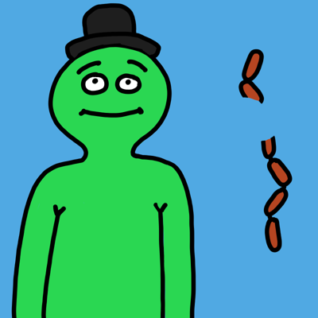
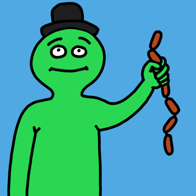
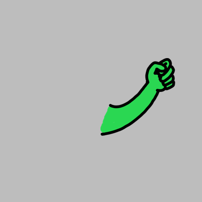
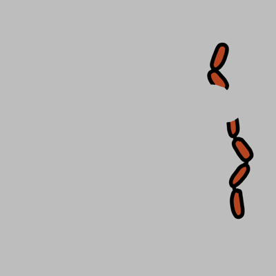

# Ratalayer

Script para generar una colección de imágenes a partir de las capas de un fichero PSD.

Permite evitar las combinaciones incompatibles mediante la asignación de categorías a las capas.

Dispone de opciones para generar todas las combinaciones posibles o solo un subconjunto al azar.

## Requisitos

Necesitas tener instalado Photoshop 24.1.1 o superior (probablemente funcione en versiones más antiguas).

## Cómo ejecutarlo

Para ejecutarlo, con la imagen abierta en Photoshop:

    Archivo > Secuencia de comandos > Explorar...

Selecciona el fichero __ratascript.jsx__

La ventana emergente te informa del número de imágenes (combinaciones de capas) que pueden construirse.

Elige el nombre de la colección y el tipo de generación:
- Only some random images: generará el número de imágenes elegido al azar.
- Complete traversal: generará todas las imágenes posibles.

El fichero PSD tiene que tener un primer nivel de grupos y, dentro de cada grupo, una capa por cada opción.

Cada capa debe tener un nombre con la siguiente estructura (los textos entre llaves son variables):

    {texto arbitrario}[{peso probabilístico}]#{categoria 1}:{valor 1}|{categoria 2}:{valor2}|...

Por ejemplo:

    nariz bruja[4]#nariz:grande|color:verde

En el apartado "Categorías" hay más información sobre cómo utilizar las categorías.

Hay un fichero PSD de ejemplo en la carpeta _demo-resources_.

Las imágenes se generan en una carpeta _build_ a la par del fichero PSD.

## Categorías

Las categorías son un mecanismo para evitar combinar capas con contenido incompatible. Por ejempo, para evitar esto:

Las salchichas en este ejemplo solo son compatibles con el brazo levantado:

Para indicar al script qué capas son compatibles, debemos establecer un valor común para ambas en una categoría. En este caso la categoría puede ser "arm", con dos valores: "up" y "down". La capa con el brazo levantado tendrá indicado, en el nombre, la categoría "arm" con el valor "up":

    raised hand#arm:up

Por su parte, la capa con las salchichas tendrá el mismo valor para la categoría:

    sausage#arm:up

Una misma capa puede tener muchas categorías, y se pueden combinar las categorías con un peso para controlar la probabilidad en el caso de generarse un subconjunto aleatorio de combinaciones.